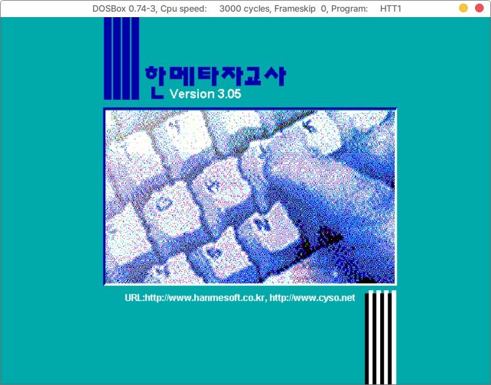

## 한메타자교사

추억의 타자 연습게임 베네치아가 있는 한메타자교사 프로그램.

* 라이선스 : 재배포 관련하여 (주)한메소프트 로부터 배포판에 탑재를 허가받았습니다.




## 설치하기 (우분투 20.04 이상)

[릴리즈 페이지](https://github.com/hamonikr/hanme-taja/releases) 에서 최신 버전의 deb 파일을 다운로드 받아서 다음과 같이 설치.

```
sudo apt-get install -f ./hanme-taja_*_all.deb

```